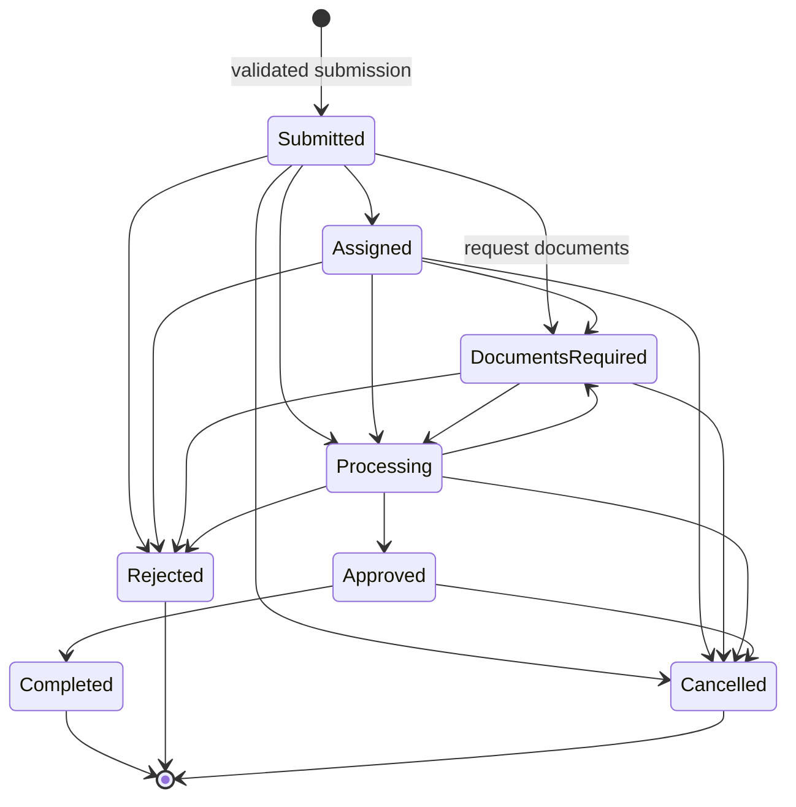

# Application Lifecycle

## 1. Current state machine

The inspected backend centrally defines these canonical stored statuses:

- `Submitted`
- `Assigned`
- `Documents Required`
- `Processing`
- `Approved`
- `Completed`
- `Rejected`
- `Cancelled`

Legacy lowercase `submitted`, `under_review`, `processing`, `completed`, and `rejected` are accepted/read for compatibility. `under_review` normalizes to `Processing`. Draft is not currently persisted. Assignment target is represented separately (`assignmentType`, expert/partner IDs), which is preferable to creating separate `assigned_to_partner` and `assigned_to_expert` lifecycle statuses.



The current design correctly blocks `Submitted -> Completed`. Timeline records are created with status changes and remarks. Assignees are restricted to a status allowlist, but the shared transition table and role/action prerequisites need to be made more explicit.

## 2. Target lifecycle semantics

Retain the current values to avoid unnecessary migration. Interpret them as:

| Status | Meaning |
|---|---|
| `Draft` (future) | Owner-only incomplete data; not operational work and not visible to assignees |
| `Submitted` | Schema, identity/OTP, CAPTCHA, required documents, and submission prerequisites passed |
| `Assigned` | One active expert or partner assignment exists |
| `Documents Required` | Processing is blocked pending specifically requested customer/authorized-party documents |
| `Processing` | Assigned/internal team is actively verifying or fulfilling |
| `Approved` | Service work/authority outcome is approved; completion artifacts/payment gates may remain |
| `Completed` | All required work, completion artifacts, and payment/receipt rules are satisfied |
| `Rejected` | Application cannot proceed; reason/category required and refund evaluation triggered |
| `Cancelled` | Authorized cancellation; reason/actor/time required and refund evaluation triggered |

`Verified` is better modeled as a document/checklist milestone or optional substate, not a top-level application status. `under_review` maps to `Processing`. Assignment target remains data, not status.

## 3. Transition command model

Clients request named actions, not arbitrary status values:

| Command | From | To | Actors | Preconditions |
|---|---|---|---|---|
| `submit` | Draft/new | Submitted | Customer owner | Active service/variant and published form; backend validation; CAPTCHA; phone verification; required upload and payment rule |
| `assign` | Submitted/Processing/Documents Required | Assigned or retain current status by policy | Admin | Valid active assignee/profile; fulfillment compatibility; no terminal state; one active assignment |
| `request_documents` | Submitted/Assigned/Processing | Documents Required | Admin; current expert/partner within policy | Non-empty safe request; document definitions; no terminal state |
| `resume_processing` | Documents Required/Assigned/Submitted | Processing | Admin/current assignee | Requested required replacements supplied or admin override with audit reason; assignment if workflow requires it |
| `approve` | Processing | Approved | Admin/current expert; partner only if business approves | Required documents verified; checks complete; no unresolved requests; payment gate satisfied |
| `complete` | Approved | Completed | Admin/current assignee | Completion documents/output present and verified where required; payment paid/not required; receipt/result reference created |
| `reject` | Submitted/Assigned/Documents Required/Processing | Rejected | Admin/current assignee with restricted reasons | Reason/category required; policy permits actor; refund evaluation event |
| `cancel` | Submitted/Assigned/Documents Required/Processing/Approved | Cancelled | Customer before cutoff; admin later | Reason; no prohibited external completion; refund/cancellation policy evaluated |
| `reassign` | Non-terminal assigned work | Assigned/current status | Admin | Close prior assignment and create new active assignment atomically |

The exact authority to approve/reject by partner or expert is a business decision. Default launch policy should be conservative: experts/partners may move assigned work among `Documents Required` and `Processing`; admin approves/rejects/completes until quality controls are proven.

## 4. Invariants

Every transition service enforces these inside the transaction:

1. Expected current state matches (optimistic concurrency).
2. Actor is active and authorized for the action and exact resource.
3. Terminal applications cannot change except a separately designed reopen command restricted to admin and audited.
4. At most one active assignment; denormalized application assignee matches active assignment record.
5. Required document checklist contains no missing/currently rejected/re-upload-required item for approval.
6. Completion requires configured completion output. Current partner workflow already requires at least one completion document.
7. Required payment is verified from gateway state, never client callback/application body.
8. Rejection/cancellation includes reason, category, actor, timestamp, and refund evaluation.
9. Status update, timeline, assignment updates, audit event, and notification outbox are atomic.
10. Duplicate command/idempotency key returns the prior result; same key with a different payload returns 409.

## 5. Transition effects

| Event | Timeline | Notifications | Other effects |
|---|---|---|---|
| Submitted | Submission created | Customer confirmation; admin/work queue event | Snapshot schema/price/documents; receipt acknowledgement (not payment receipt) |
| Assigned/reassigned | Assignee and actor | New assignee, customer; previous assignee on reassign | Close/create assignment record |
| Documents requested | Requested items and safe remark | Customer; assignee/admin as needed | Mark checklist/document replacement requests |
| Replacement uploaded | Document reference, no storage URL | Reviewer/assignee/admin | Prior doc non-current; new doc pending |
| Processing | Actor and remark | Customer | Work SLA timer starts/resumes |
| Approved | Checks summary reference | Customer/admin | Lock relevant reviews; evaluate final payment |
| Completed | Completion reference | Customer/admin/assignee | Final receipt/result availability; close lead/assignment; reward calculation event |
| Rejected/cancelled | Reason/category | Customer/admin/assignee | Close assignment/lead; refund evaluation; retention timer |

Customer-visible timeline messages must be distinct from internal notes. Do not place PII, internal fraud signals, provider payloads, or secrets in visible remarks.

## 6. Documents and payment gates

Define per-service workflow policy:

```js
{
  requiresAssignment: true,
  requiredDocumentKeys: ["identityProof"],
  documentReviewMode: "admin", // or assigned_expert after approval
  completionDocumentRequired: true,
  paymentGate: "before_processing" // none | before_submission | before_processing | before_completion
}
```

- Submission validates initial required document presence.
- Document review state is independent (`pending`, `verified`, `rejected`, `reupload_required`).
- `resume_processing` verifies requested replacements exist; it does not infer readiness from a filename.
- `approve` verifies all policy-required documents/checks.
- `complete` verifies final artifacts and payment gate.

## 7. Assignment architecture

Keep both:

- Current assignment pointers embedded/denormalized in `applications` for dashboard filtering.
- `applicationassignments` as referenced history with one-active partial unique index.

Assignment transaction:

1. Load authorized non-terminal application and candidate internal user/profile.
2. Validate role, status, activity, verification/capacity/category/fulfillment rules.
3. Close any active history row.
4. Create new active history row.
5. Update application assignment type/ID/by/at and status according to policy.
6. Create timeline/audit/outbox events.

Partner lead acceptance uses the same assignment primitive after an atomic lead claim. This avoids two sources of assignment truth.

## 8. Drafts and abandonment

Server-side drafts are P2, not required to launch if local drafts satisfy product needs. If implemented:

- status `Draft` is owner-only and excluded from operational metrics;
- stores schema version and autosave revision;
- expires after an approved period;
- temporary uploads use a separate prefix and lifecycle cleanup;
- submit atomically promotes the draft and consumes OTP/payment prerequisites;
- no application number is public until submission (or use a clearly distinct draft ID).

## 9. Public tracking

Current application-number-only tracking should not expose full timeline. Target options, in preference order:

1. Authenticated customer dashboard.
2. Signed tracking link delivered to the verified applicant channel.
3. Application number plus OTP/verified phone challenge.

Public response is a strict projection: application number, service display name, coarse status, submitted/updated dates, and sanitized milestones. It excludes form data, documents, assignments, internal remarks, payment references, and personal contact data.

## 10. Migration of existing states

- Preserve canonical title-case values and current transition logic first.
- Read legacy values through the existing normalizer.
- Backfill legacy values in batches only after dry run and backup.
- Do not create synthetic approval/completion events without evidence; flag anomalous records for admin review.
- Build an invariant report: terminal records with active assignments, assigned status without assignment, completed partner work without completion documents, invalid status, and duplicate active assignments.
- Retire compatibility reads only after no legacy values remain for an agreed period.

## 11. Lifecycle tests

- Table-test every allowed/forbidden transition for each role.
- Verify direct submitted-to-completed is rejected.
- Verify previous assignee loses access after reassignment.
- Verify document/payment/completion prerequisites cannot be bypassed.
- Race-test two lead acceptances and two transitions with the same expected state.
- Verify transaction rollback leaves no partial timeline/assignment/outbox state.
- Verify terminal state immutability and idempotent duplicate commands.
- E2E: customer submit → admin review/assign → expert or partner request/receive document → process → approve → complete → customer notification/receipt.
