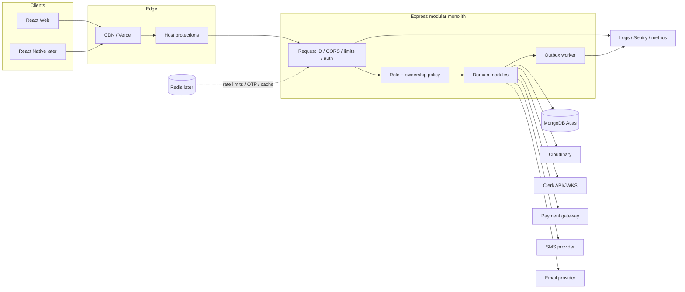
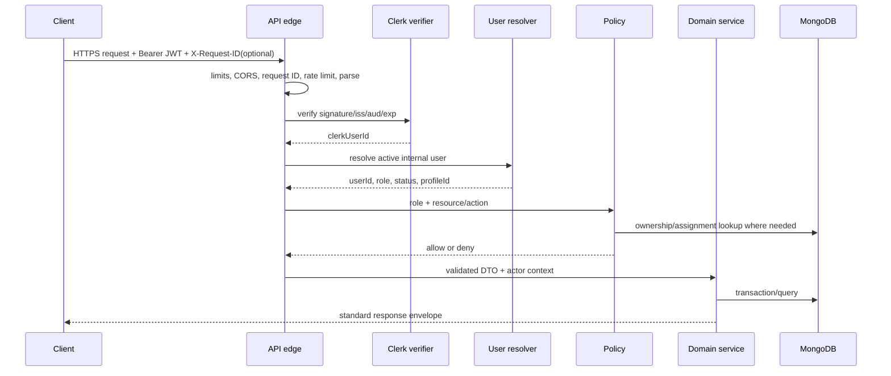
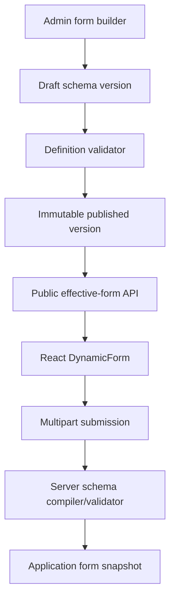
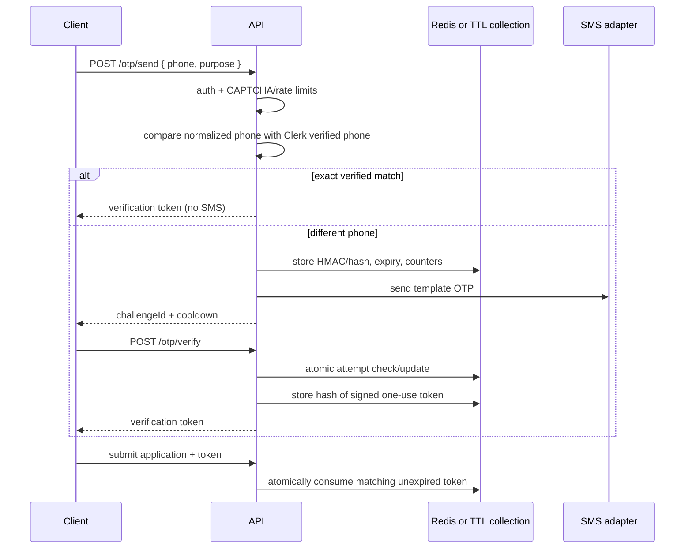
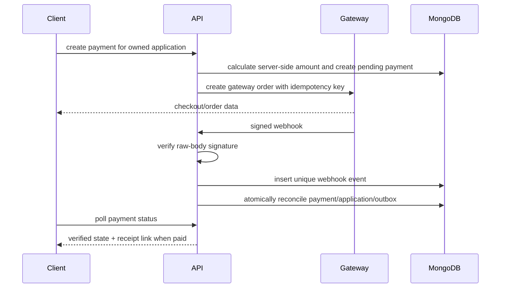

# Architecture

## 1. Scope and principles

This architecture evolves the inspected Karlo Services codebase without rebuilding it. The unit of deployment remains an Express **modular monolith** plus a React client. Modules have explicit boundaries but share one process and MongoDB database. The API is the single business-rule authority for web and future mobile apps.

Principles:

1. Authentication, authorization, ownership, and business validation are separate checks.
2. Client input never determines role, ownership, price paid, assignment, document URL, or payment success.
3. Historical applications preserve submission-time service/form/pricing snapshots.
4. Critical state changes are atomic and idempotent.
5. External providers sit behind adapters and can fail without corrupting primary state.
6. Production complexity is added from evidence, not anticipation.

## 2. Inspected code map

### Frontend map

| Area | Current implementation | Assessment |
|---|---|---|
| Bootstrap/routes | `App.jsx`, `AppRoutes.jsx` | Clean bootstrap; route lazy loading exists; protected branches lack real guards |
| Layouts | `PublicLayout`, `DashboardLayout`, sidebar/header | Shared and reusable; portal is inferred from URL only |
| Public pages | home, services, detail, apply, track, FAQ/policies | Service-to-form flow works; tracking needs stronger proof |
| Dashboards | customer, partner, expert, admin | All four active portals exist; partner functionality must be preserved |
| API layer | shared Axios plus domain API modules | Good separation; add token/error/request-ID interceptors and `/v1` base |
| Development auth | path-derived four-role headers | Useful local fixture; correctly disabled by backend in production |
| Forms | shared `DynamicForm`, CAPTCHA, variant selector | Server-driven and reusable; field vocabulary/versioning/draft/OTP need completion |
| Documents | shared `DocumentViewer` and document API | Correct server-authorized link pattern |
| Notifications | badge, bell, dropdown, list/page | In-app inbox implemented; preferences/channels/retry absent |
| CMS | admin content managers plus public CMS API | Strong initial internal CMS; some generic and specialized content models overlap |

Recommended evolution is feature-oriented only where it reduces coupling. Do not perform a mass folder move. New work can land under `features/<domain>` while existing imports migrate opportunistically. Keep `api/`, shared components, layouts, dashboards, hooks, validations, and utilities as stable top-level concepts.

### Backend map

| Layer | Current implementation | Assessment |
|---|---|---|
| Composition | `app.js`, `server.js` | Clear split; add version router, lifecycle/shutdown, readiness |
| Edge middleware | Helmet, CORS, JSON limit, Multer, dev auth, errors | Useful baseline; add request ID, logger, rate limits, schema validation |
| Routes | domain and role routers | Readable; application/admin overlap should be deprecated under `/v1` |
| Controllers | thin adapters in most modules | Good; keep HTTP concerns here |
| Services | application, variants, documents, marketplace, admin, CMS, OTP, notifications | Correct location; application service is oversized |
| Models | services/forms/apps/timeline/assignment/profiles/leads/notifications/CMS/audit/dashboard modules | Rich current domain; internal user/payment/webhook/outbox gaps |
| Seeds/migrations | services, forms, CMS, marketplace; legacy role/business/document migrations | Existing idempotency intent is good; add migration ledger/dry-run/backups |
| Tests | Node test runner contract/unit tests | Good security-focused start; add DB integration, HTTP, provider and E2E tests |

## 3. Target runtime architecture



### Module boundaries

Suggested backend modules (folders may be introduced incrementally):

- `identity`: Clerk verification, user synchronization, status/role resolution.
- `catalog`: services, variants, public search, availability.
- `forms`: form definitions, publication/versioning, schema validation.
- `applications`: submission, projections, timeline, transitions.
- `documents`: upload, metadata, access policies, replacement/review.
- `assignments`: expert/partner assignment history and capacity.
- `marketplace`: partner profiles, lead publication/matching/acceptance.
- `payments`: orders/intents, webhook events, refunds, receipts.
- `notifications`: domain events, inbox, preferences, outbox/delivery.
- `support`: tickets/replies.
- `cms`: public content, publishing, settings.
- `admin`: orchestration/read models, reports, exports, audit access.

Cross-module calls go through exported service functions. Models are not imported directly by unrelated controllers. Shared code is limited to errors, pagination, validation primitives, request context, logging, and provider interfaces.

## 4. Request pipeline



Canonical request context:

```js
req.auth = Object.freeze({
  userId: internalUser._id.toString(),
  clerkUserId: token.sub,
  role: internalUser.role,
  status: internalUser.status,
});
```

Never read application role from Clerk public metadata alone. It may be mirrored for UI hints, but MongoDB is authoritative.

## 5. Authentication lifecycle

1. Clerk client completes sign-up/login/verification and maintains the session.
2. Axios requests a short-lived Clerk token for the configured API template/audience and sets `Authorization: Bearer <token>`.
3. Backend middleware validates signature using cached JWKS, issuer, audience, expiry/not-before, and authorized party as applicable.
4. `clerkUserId` resolves one internal `users` record. Missing records are created only through a controlled sync endpoint/webhook or return `PROFILE_SETUP_REQUIRED`; never silently grant a role.
5. Suspended/deleted/pending users are rejected consistently before controllers.
6. Role guard checks coarse capability. Resource policy builds the database owner/assignment filter. A query returning no authorized record responds 404 to reduce IDOR leakage.
7. Clerk webhooks are signature-verified, deduplicated, and update identity fields/status without overwriting business roles unintentionally.

Frontend guards provide navigation and loading UX: `RequireSession`, `RequireInternalProfile`, and `RequireRole`. They are never a security boundary.

## 6. Dynamic form architecture



Keep current `ServiceForm` during the transition. Add `version`, `status`, `publishedAt`, and a uniqueness rule such as `{ service, variantKey, version }`. The API resolves base form plus variant override into an effective schema. Responses contain only fields safe for applicants.

Supported rules should be declarative and allowlisted—required, length/range, pattern identifier (not arbitrary regex from admins), option membership, file policy, and conditional `equals/not_equals/in`. Address is a structured group and declaration is a consent field. Backend rejects any submitted key outside the resolved visible schema. Schema changes do not affect existing applications because snapshots remain.

Draft strategy:

- P0/P1: preserve unsent draft locally, encrypted only if the chosen browser storage policy is acceptable; never persist document bytes long term.
- P2: server draft application with owner, schema version, expiry, and separately uploaded temporary assets. Promotion to submitted is transactional; abandoned assets have lifecycle cleanup.

## 7. OTP architecture

Applicant phone verification is independent from login identity.



The current model already has expiry, resend, attempt, verification-token hash, and consumed time, but its service lacks IP/device rate limits and submission does not call token consumption. Provider calls must use an `SmsProvider` interface; MSG91 can be the first adapter. Never log OTP/token values. Redis is preferred once there are multiple API replicas; MongoDB TTL is acceptable initially if all mutations are atomic.

## 8. Payment and receipt architecture



Pricing is computed from the application snapshot plus approved adjustments, discount, and tax lines. A unique `(provider, providerOrderId)` prevents duplicate payments; a unique `(provider, providerEventId)` makes webhook handling idempotent. Frontend callbacks are hints only. Receipt PDFs are generated after verified payment, stored privately, immutable by receipt number/version, and downloaded through an authorized short-lived link. Refunds are separate records/events; never overwrite the original payment amount.

## 9. Notification architecture

Domain services append notification/outbox events in their MongoDB transaction. In-app notification creation can remain immediate, while email/SMS delivery is asynchronous. An outbox worker claims records with a lease, calls channel adapters, records attempts/provider IDs, retries exponential backoff with jitter, and dead-letters permanent failures for admin inspection. A deterministic event/user/channel key prevents duplicates. User preferences apply except mandatory security/transactional notices.

Do not add Kafka. Start with MongoDB `notificationoutbox` plus one worker process; use a Redis-backed queue only when throughput, scheduling, or worker contention justifies it.

## 10. Error and observability architecture

The API uses `ApiError(status, message, code, errors, expose)` and one error middleware. Map validation, malformed IDs, duplicate keys, transaction conflicts, provider timeouts, and upload errors to stable codes. Every response includes `requestId`; production logs contain it with method, route template, status, latency, actor ID/role where safe, and error code.

Health endpoints:

- `GET /health`: process liveness, no dependency calls.
- `GET /api/v1/health`: readiness, bounded checks for MongoDB and required configuration; do not expose secrets/topology.

Use structured JSON logs, Sentry (or equivalent) for exceptions/releases, platform metrics for CPU/memory/restarts/latency, and uptime monitoring. Redact authorization headers, cookies, OTPs, form data, phone/email where unnecessary, signed URLs, Cloudinary credentials, Mongo URI, and document metadata.

## 11. Current coupling to reduce incrementally

- Split `applicationService` into submission, query/projection, transition, assignment, and remarks services while keeping current exports as compatibility facades.
- Consolidate legacy application routes under role/domain `/api/v1` routes; do not break existing frontend until adapters switch.
- Reconcile generic `contententries/platformsettings` with specialized CMS models. Use specialized models for structured public content; reserve generic entries for explicitly allowlisted small content blocks.
- Replace repeated pagination/regex/date parsing with validated shared request DTOs.
- Centralize actor/audit/outbox context so critical changes cannot forget audit or notification events.

## 12. Testing boundaries

- Unit: validators, policy predicates, state transitions, amount calculations, provider adapters.
- Integration: real ephemeral MongoDB replica set for transaction, uniqueness, owner filters, OTP consume, outbox claims, webhook idempotency.
- HTTP: route middleware order, response/error envelopes, upload limits, raw webhook body.
- Contract: OpenAPI examples validated in CI; web/mobile clients generated or typed from stable schemas later.
- E2E: Playwright role journeys against staging-like services/fakes.
