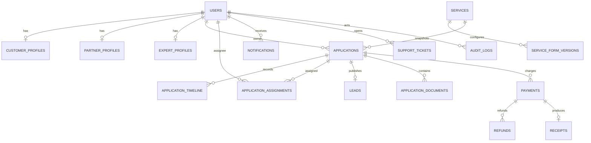

# Database Design

## 1. Data design rules

MongoDB remains the business system of record. Clerk owns identity credentials/sessions; Cloudinary owns bytes; provider records prove payments/messages. MongoDB stores mappings, policy state, business entities, immutable snapshots, provider references, and audit history.

Use references for independently growing/history entities and embedded subdocuments for bounded values always read with their parent. All dates are UTC BSON dates; currency is stored in integer minor units (paise) for new payment models. New models use timestamps and explicit collection names. Do not destructively transform existing applications.

## 2. Verified current collections

| Collection | Purpose and key fields | Important current constraints/indexes |
|---|---|---|
| `services` | Public catalogue; title/slug/category, pricing, time, availability, fulfillment, embedded variants, legacy migration mapping | unique `slug`; catalogue, migration, text-search indexes |
| `serviceforms` | One current service-driven form with sections/fields and upload/CAPTCHA options | unique/indexed `service`; field-name uniqueness validation |
| `applications` | Submission, snapshots, owner, current assignment/status, embedded document metadata | unique `applicationNumber`; owner/assignment/status indexes; unique sparse owner + submission key |
| `applicationtimelines` | Status/visible update history | application + chronological index |
| `applicationassignments` | Assignment history | application/assignee indexes; partial unique one-active-assignment |
| `applicationnotes` | Internal application notes | application + newest index; currently lacks visibility/role metadata |
| `expertprofiles` | Expert skills/categories/availability | unique `userId`; availability/status fields |
| `partnerprofiles` | Business/KYC, coverage/services, verification, counters/wallet | unique `userId`; verification/activity/availability and matching indexes |
| `leads` | Privacy-safe partner marketplace projection and acceptance | unique application; status/category/location/expiry/partner/service indexes |
| `notifications` | In-app inbox linked to applications | recipient inbox indexes; unique sparse `dedupeKey` |
| `mobileotps` | Hashed challenge and one-time verification-token state | unique user + mobile; TTL `expiresAt` |
| `auditlogs` | Actor/action/entity history with redacted before/after | time, entity history, actor history indexes |
| `banners`, `testimonials`, `faqs` | Structured CMS collections | publish/activity/delete/order lookup; FAQ text search |
| `homepages`, `sitesettings` | Logical singleton public content/settings | unique singleton keys; homepage published snapshot |
| `contententries`, `platformsettings` | Generic admin content/non-secret settings | unique keys and section ordering |
| `softwareassets`, `declarationforms` | Dashboard resources | activity/order indexes |
| `paymentrecords` | Current dashboard payment history | unique transaction ID; user/role/time index; not yet gateway-grade |
| `rewardrecords`, `referralaccounts`, `referrals` | Rewards/referrals | owner/time and referral uniqueness |
| `partnerrenewals` | Partner renewal requests | partner/time/status |
| `supporttickets` | Owner-scoped tickets with embedded replies | ticket number uniqueness; owner/status/update index |

There is no verified internal `users`, customer profile, admin profile, gateway webhook, receipt, notification preference/outbox, or migration ledger collection today.

## 3. Target relationship model



`APPLICATION_DOCUMENTS` in this diagram is a logical entity. Keep document metadata embedded at current volume; extract it only when arrays approach document size/query limits, independent retention is required, or document-level concurrency becomes significant.

## 4. Target collections

### `users` — required P0

Purpose: stable internal identity and authorization authority.

```js
{
  _id,
  clerkUserId,          // unique
  role,                 // customer | partner | expert | admin
  status,               // pending | active | suspended | deactivated
  profileType,          // customer | partner | expert | null
  profileId,            // optional ObjectId
  primaryEmail,
  primaryPhone,
  emailVerified,
  phoneVerified,
  lastLoginAt,
  termsAcceptedAt,
  deletedAt,
  createdAt,
  updatedAt
}
```

Indexes: unique `{ clerkUserId: 1 }`; `{ role: 1, status: 1, createdAt: -1 }`; partial lookup indexes on normalized email/phone only if business uniqueness is approved. Role changes are admin-only and audited. Soft deletion/deactivation preserves business references.

### Profiles

- `customerprofiles` only for business fields not appropriate in Clerk: display preferences, saved address(es), referral/account metadata. Unique `userId` referencing internal user.
- Keep current `partnerprofiles` and `expertprofiles`, migrating `userId` semantics from external/dev string to internal user ID in a backward-compatible phase. Partner verification documents remain private and excluded by default.
- A separate `adminprofiles` collection is unnecessary unless admins need domain-specific fields; use `users` plus audit permissions initially.

### `services`

Keep embedded variants. Add optional `contentVersion`, `publishedAt`, `deletedAt`, and optimistic `revision`. A service contains base pricing/time/documents/eligibility/instructions and bounded variants:

```js
variant: {
  key, slug, title, description, keywords,
  pricing, processingTime, availabilityStatus, availabilityMessage,
  requiredDocuments, optionalDocuments,
  eligibility, instructions, formConfiguration,
  displayOrder, isActive
}
```

Existing applications continue referencing the canonical service and their stored snapshots. Do not modify historical snapshots when a service changes.

### `serviceformversions` (evolution of `serviceforms`)

```js
{
  serviceId,
  variantKey,        // null for base
  version,           // integer
  status,            // draft | published | retired
  schemaHash,
  title, description, sections, fields,
  requireEmail, allowAdditionalDocuments, maxAdditionalDocuments,
  captchaRequired,
  publishedAt, publishedBy,
  createdAt, updatedAt
}
```

Unique `{ serviceId: 1, variantKey: 1, version: 1 }`; partial unique one published version per service/variant. Existing `serviceforms` can remain the compatibility/current pointer while versions are introduced.

Field schema supports `key` (map current `name`), label, type, placeholder, required, options, default value, conditional rule, order, help text, validation object, file policy, and nested address fields. Store only allowlisted rule identifiers—no executable code.

### `applications`

Retain current model and add fields additively:

- `schemaVersion` / `formSchemaHash`.
- `paymentRequirement`: none/before_submission/before_processing/before_completion.
- `amountSnapshot` in minor units.
- `cancelledAt`, `completedAt`, `deletedAt`/retention state where required.
- optional `version` for optimistic concurrency.

Current status/assignment pointers are deliberate denormalization for fast dashboards. Assignment history remains referenced. Embedded document arrays are acceptable because current maximum upload counts are bounded, but enforce a total application document count and projected BSON-size monitoring.

Suggested indexes after production query review:

- `{ customerUserId: 1, status: 1, createdAt: -1 }`
- `{ assignedExpertId: 1, status: 1, updatedAt: -1 }`
- `{ assignedPartnerId: 1, status: 1, updatedAt: -1 }`
- `{ service: 1, status: 1, createdAt: -1 }`
- existing application number and idempotency uniqueness.

Do not add every combination preemptively. Verify with `explain()` and slow-query telemetry.

### Timeline, notes, and assignments

- `applicationtimelines`: add `eventType`, `fromStatus`, `toStatus`, `actorRole`, `visibility` (`customer`, `assignee`, `admin`), and safe metadata. Avoid putting internal comments in public remarks.
- `applicationnotes`: add `createdByRole`, `visibility`, `deletedAt` only if note deletion is legally allowed. Notes are not status history.
- `applicationassignments`: keep referenced history; add `assignmentStatus` (`active`, `completed`, `reassigned`, `cancelled`), `assignedAt`, `endedReason`, actor role. Preserve the one-active partial unique index.

### Documents

Current embedded metadata should converge on:

```js
{
  _id,
  fieldKey, label, documentType, originalName,
  mimeType, extension, size, checksum,
  cloudinary: { publicId, resourceType, deliveryType, version },
  source, required,
  uploadedBy, uploadedByRole, uploadedAt,
  verificationStatus, verificationRemark, verifiedBy, verifiedAt,
  replacementRequested, replacesDocumentId, isCurrent,
  verificationHistory
}
```

Do not return the `cloudinary` object to ordinary API clients. Store a SHA-256 checksum where useful for duplicate detection. Retain old metadata fields until an idempotent migration copies them; never invalidate existing files without a verified rollback.

### OTP challenges

The current `mobileotps` collection is a valid fallback. Add `purpose`, `challengeId`, IP/device hashes, and provider message ID if MongoDB remains the store. TTL expiry is cleanup, not authorization; every query must still compare expiry and consumption atomically. Redis keys should encode purpose/user/challenge, have TTL, and use scripts/atomic operations for counters and one-time consumption.

### Payments, webhook events, refunds, receipts

Replace/bridge `paymentrecords` with gateway-grade models:

```js
payments: {
  applicationId, userId, currency,
  lineItems: [{ type, label, amountMinor }],
  subtotalMinor, discountMinor, taxMinor, totalMinor,
  status, provider, providerOrderId, providerPaymentId,
  idempotencyKey, paidAt, failedAt, metadata,
  createdAt, updatedAt
}

paymentwebhookevents: {
  provider, providerEventId, eventType,
  signatureVerified, payloadHash, receivedAt,
  status, attempts, processedAt, lastError
}

refunds: {
  paymentId, amountMinor, reason, status,
  providerRefundId, requestedBy, requestedAt, completedAt
}

receipts: {
  receiptNumber, paymentId, applicationId, userId,
  immutableSnapshot, pdfAsset, issuedAt, version
}
```

Unique indexes: provider+order ID, provider+payment ID (partial), user+idempotency key, provider+event ID, receipt number, payment+receipt version. Payment statuses: `pending`, `initiated`, `paid`, `failed`, `refunded`, `partially_refunded`. Map current `successful` to `paid` in read adapters before migration.

### Notifications and outbox

Keep current `notifications`; add optional `resourceType/resourceId` in addition to application linkage so support/payment events fit cleanly. Add `notificationpreferences` unique by user with per-channel/event choices and verified destinations. Add `notificationoutbox` with event key, payload, channels, availability time, lease, attempts, status, provider IDs, and last error. TTL/archive delivered outbox records after the agreed retention period.

### CMS and CRM

Keep structured CMS collections and their draft/publish/soft-delete semantics. Avoid duplicating the same content in both `contententries` and specialized collections. CRM data remains in `users`, profiles, leads, applications, tickets, notes, payments, and communications; no new monolithic `crm` collection.

### Migration ledger

Add `schemamigrations` with unique migration name/version, checksum, started/completed timestamps, operator/release, counts, and outcome. Seeds use stable natural keys and `$setOnInsert` for user-edited content; explicit catalogue updates use versioned seed data and controlled `$set` fields.

## 5. Embedding versus references

| Data | Choice | Reason |
|---|---|---|
| Service variants | Embed | Bounded and always presented with parent |
| Pricing/time/form snapshots | Embed in application | Immutable point-in-time evidence |
| Application documents | Embed now | Bounded and usually read with application; reassess size/concurrency |
| Timeline/assignments/audit | Reference | Unbounded history and independent pagination |
| Support replies | Embed now | Typical bounded ticket conversation; cap count/size or extract later |
| Notification delivery attempts | Reference/outbox | Independent retry lifecycle and potentially high volume |
| Payments/refunds/receipts | Reference | Financial audit, uniqueness, independent lifecycle |

## 6. Pagination, search, and reporting

- Use stable sort plus tie-breaker (`createdAt`, `_id`). Existing page/limit is acceptable for admin lists up to moderate depth; add cursor pagination for notifications/timelines/high-volume applications.
- Cap page size at 100; default 20. Return `page`, `limit`, `total`, `pages` for offset endpoints or `nextCursor` for cursors.
- Escape regex input and cap search length. Current MongoDB text index is adequate for catalogue/FAQ search initially; use Atlas Search only when relevance, language, typo tolerance, and analytics justify it.
- Exports are asynchronous jobs with filters, actor, expiry, row cap, private file, and audit event. Never make dashboards scan full collections per request.
- Create rollup/report collections only after profiling shows aggregation pressure; do not use production transactional collections for heavy ad hoc BI.

## 7. Retention and deletion

Retention periods require legal/business approval. Recommended starting policy:

- Applications, timelines, payment/receipt/audit evidence: retain per tax/regulatory/contract requirements; immutable where appropriate.
- OTP challenges: TTL shortly after verification/expiry; retain only aggregate abuse metrics.
- Notification inbox: archive/delete after 12–24 months unless linked evidence requires longer.
- Temporary/draft files: automatic cleanup after 24–72 hours.
- Support tickets: retain per support/legal policy, then redact PII where possible.
- CMS soft-deleted content: retain for recovery window, then purge with asset cleanup.

Account deletion is a workflow, not a cascade. Deactivate identity, preserve required financial/application evidence, pseudonymize fields allowed by law, and record the operation in audit logs.

## 8. Migration strategy

1. Back up and test restore.
2. Ship code that reads old and new fields.
3. Create additive indexes in staging; inspect build impact.
4. Run dry-run migration with counts and invariant checks.
5. Backfill in bounded, restartable batches with idempotent filters.
6. Compare records/checksums and exercise rollback.
7. Switch writes behind a feature flag, then reads.
8. Remove compatibility fields only in a later release after retention/approval.

Existing migration scripts are useful precedents but must never run automatically at app startup or against production without an approved backup, dry run, and release record.
