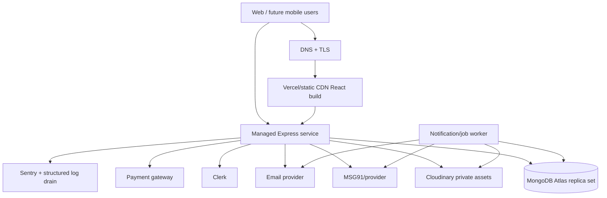

# Deployment Design

## 1. Recommended topology

Use managed services and one region close to the primary user base and data requirements.



Frontend: Vercel or equivalent static/CDN host. Backend: Render, Railway, Fly.io, or AWS managed container/application service. Choose based on region, predictable always-on behavior, private networking/egress needs, log retention, health checks, and rollback—not brand preference. Avoid serverless request runtimes until upload limits, cold starts, MongoDB pooling, webhook behavior, and long requests are verified.

## 2. Environments

| Environment | Purpose | Data/providers |
|---|---|---|
| Development | Local feature work | Local/test DB, dev Cloudinary folder/account, Clerk dev, provider sandboxes/fakes |
| Staging | Production-like integration and acceptance | Separate Atlas DB/project, Clerk instance, provider sandbox, isolated Cloudinary prefix/account |
| Production | Real users | Dedicated production secrets, DB, provider accounts, monitoring, backups |

Never share databases, Clerk instances, payment webhooks, Cloudinary folders, or secrets across staging and production. Production-like personal data should not be copied to lower environments without approved anonymization.

## 3. Build and runtime

### Frontend

- Install: `npm ci`
- Quality: `npm run lint && npm run build`
- Build output: `frontend/dist`
- SPA rewrites route unknown paths to `index.html`; API paths must not route to the SPA.
- `VITE_API_URL=https://api.example.com/api/v1`
- Only public client configuration may use `VITE_`; never place Clerk secret, Cloudinary secret, payment secret, Mongo URI, OTP secret, or SMS token there.

### Backend

- Install: `npm ci --omit=dev` after CI tests, or use a multi-stage image.
- Test in CI: `npm test`; add integration suite before launch.
- Start: `npm start` (`node src/server.js`).
- Runtime: supported pinned Node LTS; lock it in `engines`, `.nvmrc`, or container image.
- Configure graceful SIGTERM/SIGINT: stop accepting requests, finish bounded in-flight work, close HTTP server/Mongoose, then exit.
- Set platform health to liveness; readiness protects rollout until MongoDB/config are ready.

Current app uses MongoDB transactions, so local/staging/production MongoDB must support them (replica set/sharded cluster). Do not deploy against standalone MongoDB.

## 4. Environment variables

Use platform secret storage, least-privilege service credentials, rotation records, and startup validation. Suggested groups:

```text
# Runtime
NODE_ENV, PORT, APP_ENV, APP_BASE_URL, FRONTEND_ORIGINS

# MongoDB
MONGO_URI, MONGO_DB_NAME, MONGO_POOL_MIN, MONGO_POOL_MAX

# Clerk
CLERK_SECRET_KEY, CLERK_JWT_ISSUER, CLERK_JWT_AUDIENCE, CLERK_WEBHOOK_SECRET

# Cloudinary
CLOUDINARY_CLOUD_NAME, CLOUDINARY_API_KEY, CLOUDINARY_API_SECRET, CLOUDINARY_FOLDER_PREFIX

# OTP/SMS
OTP_HASH_SECRET, OTP_TOKEN_SECRET, SMS_PROVIDER, MSG91_AUTH_KEY, MSG91_TEMPLATE_ID

# CAPTCHA
CAPTCHA_PROVIDER, CAPTCHA_SECRET_KEY

# Payment
PAYMENT_PROVIDER, PAYMENT_KEY_ID, PAYMENT_KEY_SECRET, PAYMENT_WEBHOOK_SECRET

# Email
EMAIL_PROVIDER, EMAIL_API_KEY, EMAIL_FROM

# Observability
SENTRY_DSN, LOG_LEVEL, RELEASE_SHA

# Redis later
REDIS_URL
```

`DEV_AUTH_ENABLED` must be absent/false in production. Add startup assertions that reject production when it is true, required secrets are missing/placeholder values, origins are HTTP/wildcard, or development provider modes are enabled.

## 5. CORS, proxies, and network controls

- Parse an explicit comma-separated HTTPS origin allowlist; current single `FRONTEND_URL` exact check evolves to this. No wildcard with credentials.
- Allow no-origin only for deliberate clients/endpoints; bearer-token mobile requests still identify through auth, but CORS is a browser policy, not API auth.
- Configure Express `trust proxy` to the hosting topology so IP rate limits/audit IPs are correct; never blindly trust arbitrary forwarded headers.
- Atlas permits only required backend egress/private endpoints, uses TLS, least-privilege DB users, and separate environment projects/users.
- Provider webhooks are public HTTPS endpoints protected by raw-body signatures, replay/deduplication checks, and strict size limits.
- Restrict admin access further with MFA and optional step-up authentication; IP allowlisting is supplementary, not the only control.

## 6. Cloudinary layout and lifecycle

```text
karlo-services/<environment>/applications/<application-number>/submissions/
karlo-services/<environment>/applications/<application-number>/replacements/
karlo-services/<environment>/applications/<application-number>/completion/
karlo-services/<environment>/cms/<entity>/
karlo-services/<environment>/receipts/
karlo-services/<environment>/temporary/
```

The backend selects folders, private/authenticated delivery type, and transformations. Apply automatic cleanup only to `temporary/` after the approved window. Asset deletion is driven by a durable cleanup job/audit event, not solely best-effort request code. Backups must consider that MongoDB metadata without Cloudinary assets is incomplete; document restoration/reconciliation should be tested.

## 7. CI/CD pipeline

1. Checkout immutable commit and use locked dependencies.
2. Secret/dependency/license scan.
3. Frontend lint, component tests, build.
4. Backend unit, authorization, integration, upload, OTP, webhook tests.
5. Validate OpenAPI and migration/seed dry runs.
6. Build/sign artifact or container once; promote the same artifact.
7. Deploy staging; run smoke and Playwright critical journey tests.
8. Manual approval for production until deployment maturity is proven.
9. Run backward-compatible migration/index step with recorded operator/release.
10. Rolling/blue-green deploy; verify readiness, errors, latency, business smoke tests.
11. Monitor and retain previous artifact/config for rollback.

Do not automatically run catalogue/CMS seeds or destructive migrations on application startup.

## 8. Database migrations and seeds

- Back up before production migrations and perform a documented restore rehearsal.
- Use a migration ledger, dry-run mode, bounded batches, resumable checkpoints, counts, and invariant validation.
- Deploy expand/migrate/contract: code first reads both shapes, backfill, switch writes/reads, contract in a later release.
- Build large indexes with Atlas guidance and observe resource impact.
- Service/form/CMS seeds use stable keys and must not overwrite admin edits. An explicit versioned catalogue release may update allowlisted fields.
- Existing applications and snapshots are immutable migration anchors.

## 9. Backups and disaster recovery

- Enable Atlas continuous backup/point-in-time recovery appropriate to plan; define retention and restore permissions.
- Export/backup critical Cloudinary assets according to provider capabilities and business/legal requirements.
- Keep configuration-as-code and secret inventory/rotation procedure; secrets themselves remain in secret manager.
- Define launch objectives, for example RPO ≤ 24 hours and RTO ≤ 4 hours initially, then tighten after business approval.
- Quarterly: restore database to isolated environment, verify application/document/payment references, smoke test, record actual RPO/RTO.
- Maintain incident playbooks for DB loss, Cloudinary mismatch, Clerk outage, payment webhook backlog, SMS outage, leaked secret, and bad deployment.

## 10. Rollback strategy

- Application: route traffic to previous immutable artifact; preserve current DB compatibility.
- Configuration: version and roll back separately, with audit.
- Database: prefer forward fix; never rely on destructive down migration. Restore only with incident approval because it can lose new writes.
- Feature flags: disable new Clerk sync, payment, OTP provider, form version, or worker behavior without removing old data paths.
- Webhooks: keep accepting/deduplicating events during rollback; queue unprocessable events for replay.

## 11. Monitoring and alerts

Track:

- request rate, p50/p95/p99 latency, 4xx/5xx, event-loop lag, memory/CPU/restarts;
- Mongo connections, slow queries, transaction abort/retry, storage/index growth;
- application submissions and failures by safe reason code;
- upload/provider failures and orphan cleanup backlog;
- OTP send/verify/lockout rates without exposing phone/OTP;
- payment webhook delay/failure/duplicate counts and reconciliation mismatches;
- outbox depth, oldest event age, retries/dead letters;
- login/auth/profile mapping failures and suspicious authorization denies.

Alert on symptom and user effect, not every single provider retry. Dashboards separate production from staging and include release SHA.

## 12. Deployment checklist

### Before production

- [ ] Clerk auth/internal users/frontend route guards implemented and negative-tested.
- [ ] `DEV_AUTH_ENABLED` rejected in production.
- [ ] OTP token connected to submission; IP/phone/user rate limits enabled.
- [ ] Payment webhook signature/idempotency/reconciliation tests pass if payments launch.
- [ ] Exact HTTPS CORS origins and proxy trust tested.
- [ ] Atlas transaction support, network access, least-privilege user, indexes, and backups verified.
- [ ] Cloudinary private delivery, signed URL expiry, folder separation, and cleanup verified.
- [ ] Secrets are production-specific, non-placeholder, scanned, and rotation owners named.
- [ ] Request IDs, structured logs, Sentry release, uptime and alerts active.
- [ ] Accessibility, frontend build, API integration, authorization matrix, and Playwright critical journey pass.
- [ ] Data retention/privacy/refund/support policies approved.
- [ ] Runbooks, rollback artifact, backup and restore evidence available.

### Per release

- [ ] Scope and schema/API compatibility reviewed.
- [ ] Migrations/seeds dry-run and approved.
- [ ] Staging smoke/E2E complete.
- [ ] Rollout and rollback owner present.
- [ ] Post-deploy health, error, latency, submission, auth, upload, and webhook checks complete.

## 13. Scaling triggers

| Capability | Add when |
|---|---|
| Horizontal API replicas | Sustained CPU/latency or availability target exceeds one instance; bearer auth is stateless |
| Redis distributed rate limits/OTP | More than one API replica, Mongo OTP contention, or stronger atomic abuse controls needed |
| Background worker/outbox | Email/SMS/payment follow-ups enabled or provider latency affects requests |
| Public CMS/catalogue cache | Measured repeated read load; use versioned invalidation |
| Queue product | Outbox throughput/scheduling/visibility exceeds simple worker capabilities |
| Read replica/report store | Reports measurably impact transactional database |
| Separate services | Independent teams/deployments/scaling boundaries are repeatedly constrained—not merely because traffic grows |
