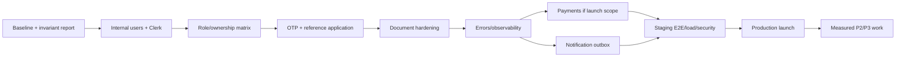

# Implementation Roadmap

## 1. Delivery approach

Do not add broad new features before identity, authorization, document, OTP, validation, and workflow foundations are safe. Deliver small backward-compatible slices with tests, feature flags, and staging evidence. No phase requires rebuilding the app, microservices, Kubernetes, or Kafka.

## P0 — Required before Clerk-enabled deployment

### P0.1 Baseline and invariants

- Freeze/record the current API/schema behavior and run the existing backend tests, frontend lint, and frontend build in CI.
- Add database-backed integration harness using a MongoDB replica set so transactions and unique indexes are actually exercised.
- Inventory production-like data without changing it: roles, legacy statuses/fields, duplicate assignments, document delivery types, missing snapshots, orphan Cloudinary metadata.
- Add migration ledger, dry-run/report mode, backup and restore procedure. Do not run existing migrations yet without approval.

**Exit:** repeatable CI; invariant report; approved recovery procedure; no data mutation.

### P0.2 Internal identity and Clerk integration

- Add `users` model with unique Clerk ID, four-role enum, status, profile link, and indexes.
- Add Clerk token verification, internal user resolver, active-account middleware, verified webhooks, and `/api/v1/auth/me`.
- Replace production route composition with Clerk auth while preserving the current `req.auth` contract.
- Add React Clerk provider, token interceptor, session/profile/role guards, suspended/setup states, and verified-role dashboard selection.
- Keep development auth explicitly gated outside production and prove the gate in tests.

**Exit:** every protected API and dashboard requires valid Clerk identity plus active MongoDB user; role spoofing fails.

### P0.3 Authorization and role cleanup

- Apply the matrix to all routes, including documents, support, dashboard modules, CMS, settings, leads, and legacy application endpoints.
- Use owner/current-assignment database filters and safe projections.
- Resolve/remove unused obsolete fifth-role UI files only after import checks; retain only the approved historical data-migration compatibility.
- Add positive/negative authorization tests for all four roles, unrelated owners, reassignment, suspended users, and forged fields.

**Exit:** authorization matrix tests pass; no active route/navigation/schema accepts a fifth role.

### P0.4 One complete application workflow

- Choose one representative service/variant and establish the launch reference journey.
- Introduce validated `/api/v1` DTOs and standard error/response envelopes without breaking current client routes.
- Connect mobile OTP UI and service to application submission: verified-Clerk-phone bypass, otherwise send/verify, then atomic one-time consume; set `mobileVerified` only after success.
- Keep CAPTCHA and idempotency; add IP/user/phone limits and a general API rate-limit baseline.
- Enforce transition actor/prerequisite rules and expected-state concurrency.
- Harden public tracking with signed proof or OTP and strict projection.

**Exit:** submit/retry/replay/expiry/invalid-transition tests pass for the reference service.

### P0.5 Document security

- Preserve private/authenticated upload and short-lived access pattern.
- Centralize safe document DTOs; ensure permanent URLs/public IDs are excluded from all application/admin serializers and logs.
- Add total request byte/document limits, extension+MIME+magic-byte checks everywhere, no-store headers, durable cleanup retry/reconciliation.
- Decide whether assigned experts may review documents. Implement only the approved policy and test every role/action.
- Add malicious, cross-owner, previous-assignee, replacement race, rollback, URL expiry, and terminal-state tests.

**Exit:** document access security suite passes; orphan cleanup is observable; policy decision recorded.

### P0.6 Errors, observability, runtime safety

- Standardize `ApiError` code/details, request IDs, structured/redacted logging, 404/error middleware, and provider error mapping.
- Add liveness/readiness, graceful shutdown, startup environment validation, exact origin allowlist, proxy trust, dependency timeouts.
- Connect Sentry/equivalent and basic alerts in staging.
- Split only the highest-risk portions of the large application service behind compatibility exports; avoid a folder rewrite.

**Exit:** failures carry request ID/code, no sensitive data appears in captured logs, deployment health/shutdown tests pass.

## P1 — Required for launch

### P1.1 Payment and receipts (if services charge online at launch)

- Select gateway and approve fee/refund/tax policy.
- Add payment, webhook-event, refund, and receipt models using minor units and unique provider keys.
- Implement server-calculated order creation, raw-body signed webhook, reconciliation/idempotency, payment gates, and private PDF receipt.
- Add duplicate, out-of-order, bad-signature, amount mismatch, failure, partial refund, and retry tests.

**Exit:** frontend never determines paid state; sandbox reconciliation is exact; finance/admin runbook approved.

If online payment is not a launch feature, explicitly set service payment requirement to `none/manual` and do not present current dashboard records as gateway-verified settlement.

### P1.2 Notifications

- Add resource-generic notifications, preferences, and transactional outbox.
- Preserve in-app inbox; add email/SMS adapters only for approved events.
- Deploy one worker with leases, exponential retry/jitter, dedupe, dead-letter visibility, and provider metrics.
- Ensure notification failure does not roll back an already-committed application.

**Exit:** no duplicate user-visible notification under retries; backlog/retry alerts work.

### P1.3 Production deployment

- Provision isolated Clerk, Atlas, Cloudinary, provider, frontend, backend, worker, monitoring, and secret stores for staging/production.
- Confirm Atlas transaction support, indexes, backups, network controls, Cloudinary folders/private delivery, CORS, TLS, and secrets.
- Implement CI/CD gates, immutable artifacts, staging smoke/E2E, migration approval, graceful rollout, and rollback.
- Complete privacy, retention, support, refund, terms, and incident procedures.

**Exit:** staging dress rehearsal and backup restore pass; production checklist is signed off.

### P1.4 Launch testing

- Backend unit/integration/HTTP suites: auth, ownership, transitions, uploads, OTP, webhooks, outbox.
- Frontend component tests: form conditions/validation/files, role guards, empty/error/loading states, document controls, dashboards.
- Playwright journeys for customer → admin → expert and customer → admin/lead → partner → completion.
- Accessibility, supported-browser, responsive, slow-network, retry, and provider-failure checks.
- Basic load test for public catalogue, login/profile resolve, dashboard lists, submission (with provider fakes), and notification reads.

**Exit:** critical journeys pass in staging; agreed latency/error targets and no critical accessibility/security defects.

## P2 — Important after launch

- Versioned immutable form publication and variant-specific form versions.
- Server-side drafts with expiry/temp-file lifecycle if analytics show abandonment needs it.
- Expand field types to structured address/declaration and shared schema-driven frontend/backend validation tooling.
- Admin payment reconciliation/export, asynchronous report/export jobs, richer lightweight CRM follow-ups/communication history.
- Malware scanning/quarantine for uploads based on risk assessment.
- Redis for distributed rate limits and OTP before/with horizontal scaling.
- Public CMS/catalogue ETag/cache and Atlas Search only after measurements.
- Customer profile and expert support/payment modules only when requirements are approved.
- Archive/retention jobs and account deletion/pseudonymization workflow.

## P3 — Future scaling and mobile

- React Native Android/iOS clients using the same `/api/v1`, Clerk audience, multipart uploads, workflow, and short-lived document access.
- Push notification device-token registry and preferences.
- Horizontal stateless API/worker replicas, Redis-backed coordination, autoscaling after load evidence.
- Separate reporting/read workloads when aggregates affect transactions.
- Read replicas/Atlas tier changes based on query and capacity metrics.
- Consider extracting a service only after repeated evidence of independent ownership, release cadence, or scaling constraints.

## 2. Suggested implementation sequence

## 3. Testing matrix by area

| Area | Unit | Integration/HTTP | E2E |
|---|---|---|---|
| Clerk/user mapping | claims/status policy | JWKS/webhook/missing/suspended mapping | login, onboarding, logout, wrong role |
| Authorization | policy table | every route with cross-owner/current/previous assignee | direct URL/API navigation |
| Forms | conditions/rules | published schema, unknown fields, snapshots | valid/invalid service applications |
| Uploads | signatures/extensions | Multer limits, Cloudinary fake, rollback/access URL | upload/preview/replace |
| OTP | hashing/token rules | rate, expiry, race, one-use consume | different phone and verified-phone bypass |
| Lifecycle | transition table | transaction/prerequisites/concurrency | full customer/admin/assignee journey |
| Payments | amount/refund rules | raw webhook/signature/deduplication | sandbox pay/fail/refund/receipt |
| Notifications | event/preferences | outbox claim/retry/dedupe | inbox + email/SMS fake |
| CMS | publication/URL validation | admin auth/soft delete/public projection | edit/publish/see public page |

Mandatory role assertions:

- customer cannot access admin APIs or another user's resources;
- partner cannot access expert-private APIs;
- expert cannot access partner-private APIs;
- admin accesses only management APIs and cannot bypass business prerequisites;
- unrelated/previously assigned users cannot access documents;
- unknown/obsolete role input is rejected.

## 4. Approval gates

User/business approval is required before implementing:

1. Clerk onboarding/provisioning policy and who may promote customer → partner/expert/admin.
2. Whether partner-assisted application creation is permitted; default design says customer-only.
3. Whether assigned experts can verify/reject documents; current implementation is admin-only.
4. Final lifecycle authority: who may approve, reject, complete, cancel, or reopen.
5. Payment gateway, currency/tax/additional charge/discount/refund rules and whether payment is launch scope.
6. SMS/email providers, templates, sender registration, OTP limits, and verified-Clerk-phone bypass UX.
7. Public tracking proof method and fields safe to display.
8. Data/document/audit/payment retention, account deletion, privacy and legal policies.
9. Hosting region/providers, availability target, RPO/RTO, monitoring and backup budget.
10. Cloudinary malware scanning requirement and acceptable file types/sizes/counts.
11. Removal of unused legacy role UI files and execution of any legacy data migration.

## 5. Definition of done for each slice

- Behavior and threat model agreed.
- API/schema is backward-compatible or versioned.
- Authorization and validation are server-side with negative tests.
- Migration is additive, idempotent, dry-run/rollback documented, and not auto-run.
- Logs/metrics/audit contain required safe context and no sensitive values.
- Frontend includes loading/empty/error/accessibility states.
- Unit/integration/E2E coverage is proportional to risk.
- Staging evidence and rollback are recorded.
- Documentation/OpenAPI/runbooks are updated.
