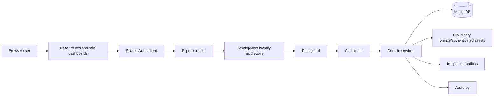
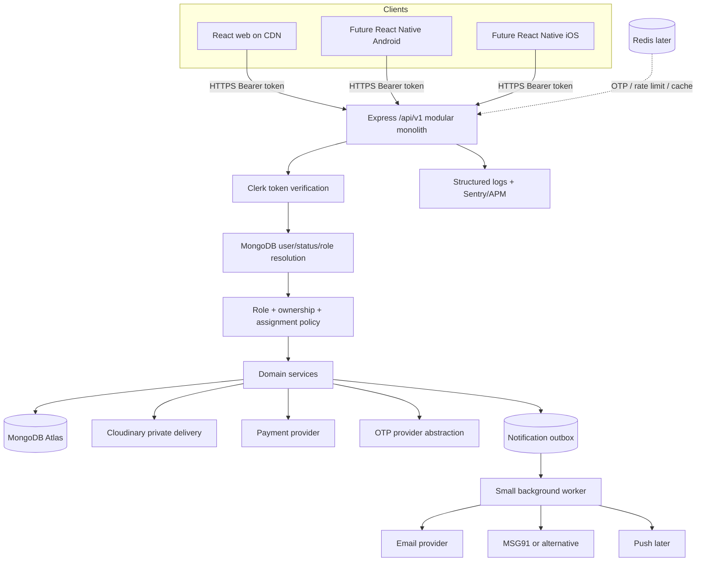

# Karlo Services — Production System Design

**Status:** proposed production architecture based on code inspected 2026-07-23  
**Scope:** document and evolve the existing MERN modular monolith; no application code, production data, or deployment was changed.

## 1. Executive summary

Karlo Services is already more than a prototype. The inspected implementation has a React/Vite client, an Express/Mongoose API, MongoDB-backed service and form configuration, parent services with embedded variants, application snapshots, Cloudinary-backed documents, assignment history, partner lead marketplace, in-app notifications, CMS, audit logs, and role-specific dashboards. The right production direction is to retain this **modular monolith** and harden its boundaries.

The production target is one versioned API serving web and future mobile clients. Clerk proves identity; MongoDB remains authoritative for application role, account status, internal profile, ownership, and business relationships. Every protected operation applies three separate gates: authentication, role permission, and resource ownership/assignment. Business transitions, payment verification, OTP consumption, file access, and notification creation remain server-side.

Production must be blocked until P0 issues are closed: real authentication and frontend route guards, an internal `users` mapping, connected one-time mobile verification, systematic request validation/rate limiting, secure document review policy, authorization regression tests, and consistent errors. See [IMPLEMENTATION_ROADMAP.md](./IMPLEMENTATION_ROADMAP.md).

## 2. Verified current architecture

### Frontend

- React 19, Vite 8, Tailwind 4, Axios, and React Router 7.
- `App.jsx` supplies `BrowserRouter`; `AppRoutes.jsx` lazy-loads public, customer, partner, expert, and admin pages under shared public/dashboard layouts.
- `DashboardLayout` infers the portal from the URL and supplies a role-specific sidebar/header. This is presentation selection, **not** an authorization guard.
- A shared Axios instance uses `VITE_API_URL`, credentials, a ten-second default timeout, and development-only `x-dev-user-id` / `x-dev-role` headers. Upload submission extends the timeout to two minutes and supplies an idempotency key.
- API modules are split by domain/role (`serviceApi`, `customerApi`, `partnerApi`, `expertApi`, `adminApi`, CMS, documents, notifications, dashboard modules).
- The form renderer supports configured fields, conditional visibility, sections, files, additional labelled documents, declaration, and CAPTCHA. Client checks improve UX; the backend repeats authoritative validation.
- Document UI asks the backend for metadata and short-lived access links. It never needs Cloudinary credentials.
- Loading, empty, status, table, confirmation, and dashboard widgets are shared. Route-level lazy loading is already used.

### Backend

- Express 5 application with Helmet, exact single-origin CORS, 1 MB JSON limit, health, service, application, role, notification, CMS, dashboard-module, OTP, and admin routes.
- Routes call middleware, controllers, domain services, then Mongoose models. Controllers are mostly HTTP adapters; large business workflows live mainly in `applicationService`, `partnerMarketplaceService`, `documentAccessService`, and admin/CMS services.
- Development auth is explicitly unavailable in production and creates the future-compatible `{ userId, role }` contract. The canonical roles are customer, partner, expert, and admin.
- MongoDB transactions coordinate application creation/timeline/notification, assignments, lead acceptance, and OTP consumption patterns; production MongoDB therefore requires transaction support.
- Multer `memoryStorage` enforces hard count/size/MIME ceilings. Application services additionally check extensions/accept rules and file signatures before upload.
- Cloudinary uploads are grouped by application number. Metadata is stored in application document subdocuments; rollback attempts delete already-uploaded assets when persistence fails.
- Applications retain service, pricing, processing-time, required-document, and form snapshots, protecting old submissions from later catalogue edits.
- Tests cover role guards, ownership/document access, file signatures, form validation, service variants, CMS constraints, partner marketplace privacy, and core schemas. They are primarily unit/contract tests, not database-backed end-to-end coverage.

### Current data flow

### Current application lifecycle

The canonical stored statuses are `Submitted`, `Assigned`, `Documents Required`, `Processing`, `Approved`, `Completed`, `Rejected`, and `Cancelled`. Some legacy lowercase values remain readable. Transitions are centrally defined and invalid direct transitions are rejected. Timeline entries are referenced records; legacy embedded status history is read-only compatibility data. Draft state is currently only a desired future capability, not a persisted application workflow.

### What is already well designed

- Four canonical role constants are shared conceptually on client and server.
- Customer, expert, and partner application queries use owner/assignment filters; document endpoints conceal unauthorized resources as not found.
- One active assignment is enforced with a partial unique index while assignment history remains queryable.
- Partner lead acceptance is atomic and publishes privacy-safe lead projections before acceptance.
- Service variants are embedded, normalized, searchable, and snapshotted into applications.
- Submission idempotency is scoped to customer plus key.
- Notification inbox reads are owner-scoped and notification events can be deduplicated.
- Documents use opaque derived IDs and short-lived server-authorized Cloudinary URLs.
- CMS supports draft/publish, schedules, soft deletion, singleton site/homepage content, and public projections.
- Admin dashboards use summary endpoints rather than loading complete datasets.

### Incomplete or risky areas

| Finding | Production effect | Direction |
|---|---|---|
| Clerk and internal user mapping are absent | No production login; dev middleware intentionally returns 503 | Implement the design in `AUTHORIZATION_MATRIX.md` before deployment |
| Frontend dashboard branches have TODOs rather than real guards | Wrong-role pages may render before APIs return 403 | Add authenticated role/active-account guards; API remains authoritative |
| OTP endpoints/model exist, but submission neither validates nor consumes `mobileVerificationToken`; current form UI does not run OTP flow | Applicant phone is stored with `mobileVerified: false` | Connect verified-Clerk-phone bypass or atomic token consumption at submission |
| Public tracking requires only an application number | Enumeration/leak risk if numbers escape; timeline may disclose remarks | Require a second factor or signed tracking token and return a strict public DTO |
| Document review is admin-only despite expert review workflow expectations | Expert cannot verify/reject; design intent and code differ | Approve a narrow expert-on-assigned-application policy or keep admin-only explicitly |
| Permanent `secureUrl` is stored in document subdocuments | Accidental serialization or future delivery-mode mistakes can expose storage links | Retain for migration compatibility but select it out; prefer public ID plus private delivery metadata |
| No request schema library; validation is distributed | Inconsistent errors and mass-assignment risk | Add Zod/Valibot schemas at route boundary and retain Mongoose checks |
| No general or endpoint rate limiting | OTP, tracking, auth, and upload abuse | Add proxy-aware layered rate limits and quotas |
| No real payment gateway/webhooks/receipt PDFs | Payment records are dashboard data, not verified settlement | Add payment intent, webhook event, payment, and receipt workflow |
| Notification delivery is synchronous/in-app only | Provider latency could affect requests; no retry/preferences | Transactional outbox plus small worker when email/SMS is enabled |
| `applicationService.js` is very large | Higher change risk and coupled workflows | Extract submission, transition, query, assignment, and document orchestration services incrementally |
| API is unversioned and responses vary (`data`, top-level domain values, `details`) | Mobile/client evolution becomes brittle | Introduce `/api/v1` compatibility mount and standard envelopes |
| No global request ID, structured logger, error tracker, shutdown handling, or readiness check | Slow diagnosis and unsafe rolling deploys | Add observability baseline before launch |
| Obsolete fifth-role UI page files remain, although they are not routed or accepted | Confusion and accidental resurrection | Remove/archive only after confirming no imports; keep migration script solely for historical conversion |
| Customer/admin profile collections are absent | Clerk identity and business profile/status cannot be managed consistently | Add internal `users`; add customer profile only when fields justify it; admin often needs no separate profile |

## 3. Target high-level architecture

### Layer responsibilities

- **Clients:** rendering, accessible form UX, token acquisition, upload transport, optimistic feedback. No final business decisions.
- **API edge:** CORS, request ID, size/time limits, authentication, rate limits, parsing, schema validation, response envelope.
- **Authorization:** resolves internal user and applies role plus resource policy. Never accepts role/owner from request bodies.
- **Controllers:** translate HTTP input/output only.
- **Services:** transitions, transactions, price snapshots, assignments, payment/OTP verification, document orchestration, event emission.
- **Models/repositories:** persistence, indexes, atomic filters, projections. A repository abstraction is optional; introduce it only where queries are repeated or hard to test.
- **Providers:** adapters hide Clerk, Cloudinary, SMS, email, and payment-specific contracts.
- **Outbox/worker:** reliable side effects after business transactions. A MongoDB outbox and one worker are sufficient; Kafka is not appropriate now.

## 4. Core production workflows

### Customer application

1. Client fetches active parent service, chosen variant, and effective form schema.
2. Backend returns public-only service/form data and a schema version/hash.
3. Client saves drafts locally initially; P2 server drafts may be stored with owner and expiry.
4. Applicant verifies phone unless it exactly matches a Clerk-verified phone.
5. Client submits multipart data with Clerk bearer token and idempotency key.
6. API authenticates, loads active internal user, validates role/status, applies request schema, CAPTCHA/rate limits, validates dynamic fields/files and atomically consumes the OTP token.
7. Files upload privately. In one database transaction the application snapshot, timeline, and outbox records are created. On failure, uploaded assets are cleaned up; failed cleanup is retried/audited.
8. Payment-required applications move through a payment gate. Submission/business processing does not trust frontend success.
9. Customer receives an application number and can see the owned application in the dashboard.

### Assignment and fulfilment

- Admin assigns an expert/partner, or publishes an eligible partner/hybrid application as a privacy-safe lead.
- Assignment is stored both as current denormalized pointers on the application (fast reads) and as immutable/history records in `applicationassignments` (audit/history).
- Expert/partner reads require current assignment equality on every request.
- Status service validates transition, actor capability, documents, payment, and completion prerequisites; it then writes application, timeline, audit/outbox records transactionally.

### Documents

- Clients never submit Cloudinary URLs or public IDs.
- Upload is streamed from memory to Cloudinary only after policy checks.
- Metadata is returned without storage IDs/URLs.
- View/download endpoints re-evaluate access and issue a five-minute link with no-store headers.
- Replacement makes the previous document non-current; metadata and review history remain for audit.

## 5. Role interaction summary

| Capability | Customer | Partner | Expert | Admin |
|---|---|---|---|---|
| Browse active services/CMS | Public | Public | Public | Public + manage |
| Submit application | Own identity | No (unless future assisted flow is explicitly approved) | No | No |
| View application | Own | Currently assigned | Currently assigned | All within admin duties |
| Change status | Cancel before configured cutoff | Limited assigned workflow | Limited assigned workflow | Governed full workflow |
| Documents | Own, upload requested replacement | Assigned read/upload completion/replacement | Assigned read; review only if policy approved | Read/review/manage |
| Leads | None | Eligible marketplace and accepted own | None | Publish/manage/assign |
| Notifications/profile/support | Own | Own | Own; support module to add | Management and own notifications |
| Payments | Own verified payments/receipts | Own wallet/payout/fees | Compensation later if required | Reconcile/refund/report |

The full action matrix and policy rules are in [AUTHORIZATION_MATRIX.md](./AUTHORIZATION_MATRIX.md).

## 6. Service and form engines

Parent families remain one `services` record with embedded variants because variants are bounded, loaded together, and administered together. A selected variant overrides pricing, processing time, required documents, availability, terms, and form configuration. Applications snapshot all effective values. Standalone legacy service records are mapped to parents with `legacyServiceIds`, `legacySlugs`, and migration markers; migrations must be dry-run, backed up, idempotent, and never rewrite historical application service/snapshot references destructively.

The existing form engine should be extended rather than replaced. Canonical field types should include `text`, `textarea`, `number`, `email`, `phone` (map legacy `tel`), `date`, `select`, `radio`, `checkbox`, `file`, `address`, and `declaration`. Each published schema is versioned and immutable; edits create a new version. Server validation compiles the same schema semantics independently and rejects unknown fields, hidden-field injection, invalid conditions/options, oversized/count-excess files, bad signatures, and invalid declarations. See [DATABASE_DESIGN.md](./DATABASE_DESIGN.md).

## 7. CMS and lightweight CRM

**CMS** controls public content: homepage, banners, testimonials, FAQs, service copy, contact data, policies, SEO, and site settings. Existing draft/publish and soft-delete behavior should remain.

**CRM** is operational relationship history: users/profiles, leads, applications, support tickets, notes/follow-ups, payments, and communication history. Keep this lightweight CRM inside the existing admin dashboard. A separate enterprise CRM is justified only when sales pipelines, external integrations, automation, or reporting exceed the modular monolith.

## 8. Mobile readiness

The backend becomes client-neutral by using `/api/v1`, bearer tokens, JSON/multipart contracts, cursor/page metadata, idempotency keys, and no browser-only business rules. React Native uses Clerk's mobile SDK/session storage, sends the same token audience, uploads with multipart/form-data, and uses the same short-lived document URL endpoint. Push tokens are device records tied to internal users, never fields on applications. Web cookies are optional; mobile does not depend on them.

## 9. Scaling strategy

1. **Launch:** static frontend CDN, one Express service, MongoDB Atlas replica set, Cloudinary, Clerk, one region, Sentry/log drain, backups.
2. **Operational growth:** horizontal API replicas (stateless bearer auth), MongoDB-backed outbox worker, Redis for distributed rate limits and OTP, CDN/private delivery tuning.
3. **Read pressure:** cache only public catalogue/CMS with explicit invalidation; move exports/reports to queued jobs; add compound indexes from observed queries.
4. **Sustained scale:** Atlas tier/read replicas for safe read-only workloads, separate worker deployment, connection pool tuning, load tests. Split services only when ownership/deployment/scale evidence warrants it.

## 10. Decision record

- Keep a modular monolith; no microservices, Kubernetes, or Kafka.
- Keep MongoDB references for unbounded history and embedded variants/documents while bounded.
- Keep current partner dashboard and marketplace.
- Use Clerk only for identity/session; MongoDB owns authorization state.
- Treat current payment records as placeholders/history, not proof of settlement.
- Require MongoDB transaction support in staging and production.
- Introduce changes through backward-compatible `/api/v1`, additive migrations, feature flags, and rollback plans.

## 11. Related documents

- [ARCHITECTURE.md](./ARCHITECTURE.md)
- [DATABASE_DESIGN.md](./DATABASE_DESIGN.md)
- [API_DESIGN.md](./API_DESIGN.md)
- [AUTHORIZATION_MATRIX.md](./AUTHORIZATION_MATRIX.md)
- [APPLICATION_LIFECYCLE.md](./APPLICATION_LIFECYCLE.md)
- [DEPLOYMENT_DESIGN.md](./DEPLOYMENT_DESIGN.md)
- [SECURITY_CHECKLIST.md](./SECURITY_CHECKLIST.md)
- [IMPLEMENTATION_ROADMAP.md](./IMPLEMENTATION_ROADMAP.md)
